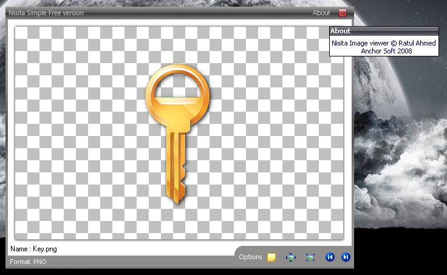



## Nisita Transparent Image Viewer

### Description

This code is very diffrent from other image viewer u'll find in this site. i'v seen most of them then decided to make one of my. It can show you populer transperent images ( bmp, png, tga, gif ) etc. thanx to lavopa for his hard work. you'll learn so many basic and advanced thing through this code. I'm sorry for some limitations and bugs, i'm so much busy with my study now. please vote me if u like the code. and sorry again for may lackings. But i hope u'll like the GUI.
 
### More Info
 
can't find one, commant me if u do.

             |
---                |---
**Submitted On**   |2008-04-05 09:42:58
**By**             |[Ratul Ahmed](https://github.com/Planet-Source-Code/PSCIndex/blob/master/ByAuthor/ratul-ahmed.md)
**Level**          |Advanced
**User Rating**    |4.4 (40 globes from 9 users)
**Compatibility**  |VB 6\.0
**Category**       |[Graphics](https://github.com/Planet-Source-Code/PSCIndex/blob/master/ByCategory/graphics__1-46.md)
**World**          |[Visual Basic](https://github.com/Planet-Source-Code/PSCIndex/blob/master/ByWorld/visual-basic.md)
**Archive File**   |[Nisita\_Tra21316810232008\.zip](https://github.com/Planet-Source-Code/ratul-ahmed-nisita-transparent-image-viewer__1-71281/archive/master.zip)

